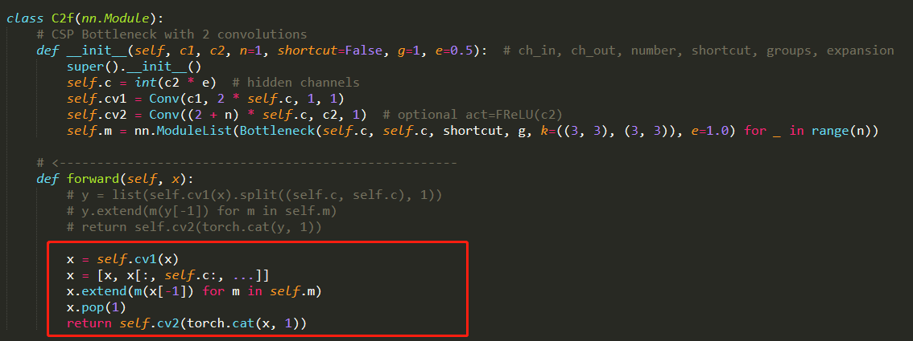
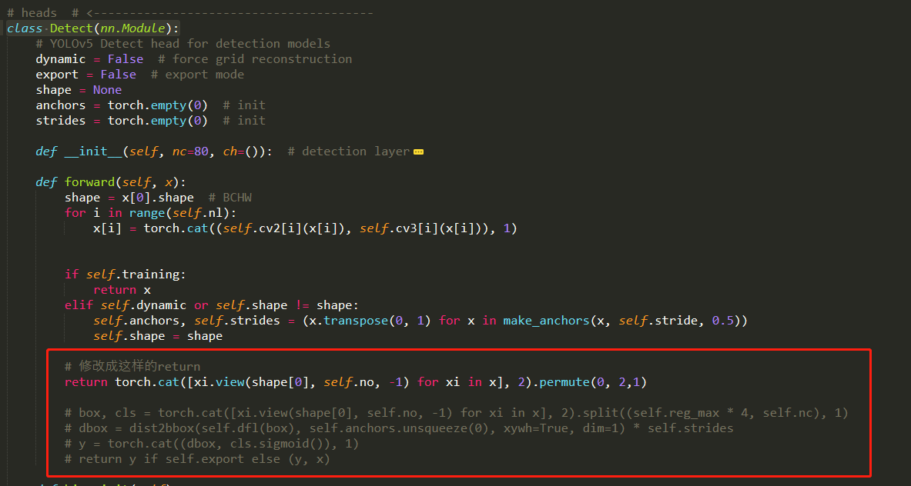
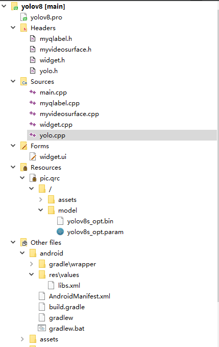

## YOLOv8 安卓手机部署

本项目将YOLOv8s通过QT和NCNN部署到小米手机上运行

### 1.模型转换的Trick

+ 修改`ltralytics\nn\modules.py`

这一部分主要涉及两个方面的修改一个`c2f bloack`中将split改为slice(**该过程不是必要的**)，另一个是去掉detect的头（加上detect的头可以转出来，但是ncnn转出的模型维度不正确，detect的head将在ncnn中通过自定义layer实现）

<div align=center>
    
</div>

<div align=center>
    
</div>

+ 转onnx

请参考： https://github.com/DataXujing/YOLOv8

+ 使用ONNX2NCNN生成ncnn支持的模型

```
onnx2ncnn yolov8s.onnx yolov8s.param yolov8s.bin
```

+ ncnnoptimize生成FP16模式的模型

```
ncnnoptimize.exe yolov8s.param yolov8s.bin yolov8s_opt.param yolov8s_opt.bin 65536
```

### 2.基于QT的NCNN安卓程序编译

关于QT安卓开发的相关配置和QT和NCNN开发安卓程序的其他应用请参考笔者的其他几个项目，内有详细的介绍

+ https://github.com/DataXujing/Qt_NCNN_NanoDet
+ https://github.com/DataXujing/ncnn_android_yolov6

<div align=center>
    
</div>

该部分代码除了模型文件已经全部在该项目中！

### 3.小米手机上的Demo


|         小米手机Demo1         | 小米手机Demo2 |
| :---------------------------: | ------------- |
|  |               |


### 4.download apk

+ apk下载地址：